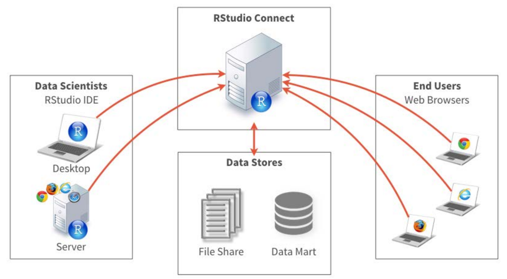
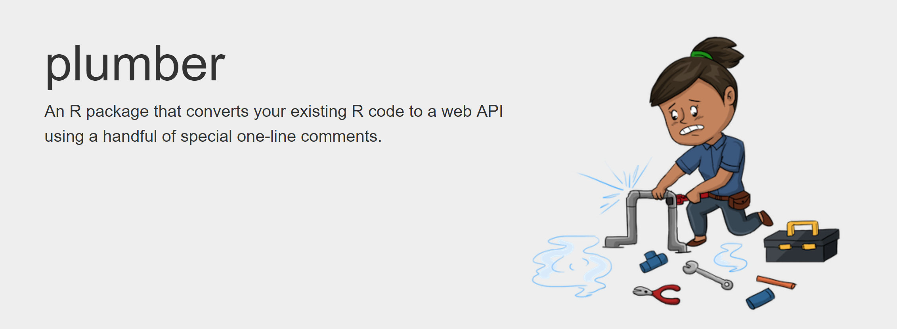
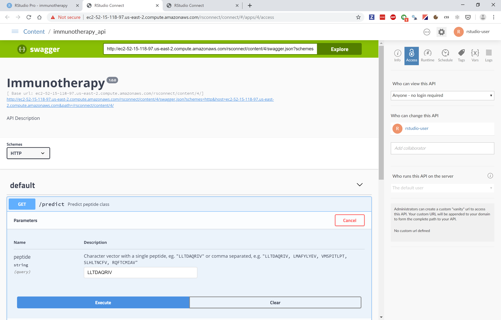

layout: true

```{r, echo=FALSE}
## Insert navigation buttons
htmltools::div(
  class = "navigation-buttons navigation-buttons-first",
  onclick = "slideshow.gotoFirstSlide();",
  "<<"
)
htmltools::div(
  class = "navigation-buttons navigation-buttons-prev",
  onclick = "slideshow.gotoPreviousSlide();",
  "<"
)
htmltools::div(
  class = "navigation-buttons navigation-buttons-next",
  onclick = "slideshow.gotoNextSlide();",
  ">"
)
htmltools::div(
  class = "navigation-buttons navigation-buttons-last",
  onclick = "slideshow.gotoLastSlide();",
  ">>"
)
```

---

class: title-slide, middle, center

```{r setup, include=FALSE}
options(htmltools.dir.version = FALSE)
workshop_identifier <- params$workshop_identifier
presentation_url <- params$presentation_url
```


```{r, echo = FALSE}
## Create title slide
htmltools::h1(rmarkdown::metadata$title)
htmltools::h2(rmarkdown::metadata$subtitle)
htmltools::h3(rmarkdown::metadata$author)
htmltools::h3(Sys.Date())
```

---

## Outline

Taking TensorFlow into Production

* Data science and machine learning with R

* TensorFlow

* Challenges of production deployment


---

## But first

To follow along and try it yourself:

* Accessing the Virtual Machine

    - Go to https://rstd.io/class
    - Use the workshop identifier **`r workshop_identifier`**
  

* Instructions at https://github.com/sol-eng/classroom-getting-started

---

class: toc-slide

## Agenda
    
---

## Find the material

.larger[

- Immunotherapy repo at:

    - https://github.com/sol-eng/immunotherapy

- This presentation at:

    - `r presentation_url`
]

---
class: subtitle-slide

## TensorFlow

.center[

]


---

### A general purpose numerical computing library

.pull-left[
-  Originally developed by researchers and engineers working on the Google Brain Team for the purposes of conducting machine learning and deep neural networks research.
- Open source software
- Hardware independent
    - CPU (via [Eigen](http://eigen.tuxfamily.org/) and [BLAS](https://en.wikipedia.org/wiki/Basic_Linear_Algebra_Subprograms))
    - GPU (via [CUDA](https://en.wikipedia.org/wiki/CUDA) and [cuDNN](https://developer.nvidia.com/cudnn))
    - TPU ([Tensor Processing Unit](https://en.wikipedia.org/wiki/Tensor_processing_unit))
- Distributed execution and large datasets
]
.pull-right[

]


---

### What is deep learning?

Input to output via layers of representation


---

### Layers of representation


 


---

class: subtitle-slide

## Problem description: Peptide classification

---


### About peptides

From [Wikipedia](https://en.wikipedia.org/wiki/Peptide)

> Peptides (from Greek language πεπτός, peptós "digested"; derived from πέσσειν, péssein "to digest") are short chains of amino acid monomers linked by peptide (amide) bonds.

.center[

]


The package `PepTools` is

> "An R-package for making immunoinformatics accessible". 

---

### Convert peptide to numeric representation


```{r, eval=FALSE}
library(PepTools)
library(magrittr)
pep_encode("LLTDAQRIV")[1, , ] %>% rasterImage()
```


```{r echo=FALSE, fig.height=6}
suppressPackageStartupMessages({
  library(PepTools, quietly = TRUE)
  library(magrittr, quietly = TRUE)
})

#' Use palette from ColorBrewer to recolour the image
#'
#' @param x Matrix
#' @param palette ColorBrewer palette. This value is passed to [scales::col_numeric()]
#' @param zero_colour Colour to use for zero and NA values
#' @param invert If `TRUE`, inverts the colour scale
recolour <- function(x, palette = "Blues"){
  dims <- dim(x)
  col_range <- range(x, na.rm = TRUE)
  col_custom <- scales::col_numeric(
    palette = palette, domain = col_range
  )
  as.raster(matrix(col_custom(x), nrow = dims[1], ncol = dims[2]))
}

## Plot peptide representation
plot_peptide <- function(x, palette = "Blues"){
  
  plot.new()
  x %>% 
    pep_encode() %>%
    .[1, , ] %>% 
    recolour(palette = palette) %>% 
    rasterImage(0, 0, 1, 1, interpolate = FALSE)
  title(paste0("Peptide representation of ", x))
}

plot_peptide("LLTDAQRIV")

```


---

### Why should you care?

The machine learning task is quite simple, but also a good example of an extremely common modeling task:

* Predict the class of an observation, based on some features of this observation
* In the case of the peptides example, the observation is a text string, which is expanded into a 9x20 tensor, and the task is a ulti-class classification.

Many other problems are very similar, for example:

* Binary classificiation of credit card default
* Multi-class classification of images
* Preduction of customer churn (binary class)

In the case of the peptides, the modeling task is very simple, allowing the focus on the overall production deployment process.  In many real-world situations the modeling task is likely to be much more complex.

---

class: class: subtitle-slide

## Workflow

---

### Workflow: objective

The objective:

* Train a TensorFlow model
  - Given some input, predict the class
  
* Deploy the model to a production server
* Get a prediction from the server

---

### Objective


---

### Training the model


---

### Deployment


---

class: panel-narrow-slide

### Deployment with RStudio Connect

.center[

]


---

class: subtitle-slide

## Demo

---

### Demo

* Train a TensorFlow model
* Deploy the model
* Deploy an API to call the TensorFlow API
* Consume the model


---

### Publish TensorFlow model

```r
library(rsconnect)

rsconnect::deployTFModel(
  modelDir = "saved_models",
  appTitle = "immunotherapy",
  forceUpdate = TRUE
)
```

---

### Your TensorFlow model is available as an API


---

### Call the API using `curl` or `httr`

Use `httr::POST()` from R.

```{r, eval=FALSE}
  # transform input into flattened array
  x_val <-
    peptide %>%
    pep_encode() %>%
    array_reshape(dim = c(nrow(.), 9*20)) #<<

  # construct http body
  body <- list(instances = list( #<<
    x_val                        #<<
  ))                             #<<

  # make http request
  r <- POST(api_url, body = body, encode = "json", content_type_json()) #<<

  # check for errors
  if (httr::http_error(r)){
    cat(http_status(r))
    stop(http_status(r))
  }
```

---

### Using the `config` package

Use the `config` package to store variables that depend on your enviroment.

https://github.com/rstudio/config


.pull-left[
**config.yml**

```yaml
default:
  trials: 5
  dataset: "data-sampled.csv"
  
production:
  trials: 30
  dataset: "data.csv"
```
]

.pull-right[
**R**

```r
config <- config::get()
config$trials
config$dataset
```
]


---

### How does the function know where the API is?


**config.yml**

```yaml
default:
  solo_url_tensorflow: "http://*****.amazonaws.com/rsconnect/content/2"
  solo_url_plumber:    "http://*****.amazonaws.com/rsconnect/content/3"

colorado:
  solo_url_tensorflow: "https://colorado.rstudio.com/rsc/content/2328/"
  solo_url_plumber:    "https://colorado.rstudio.com/rsc/content/2337/"
```

**plumber/3_consume_tf_api.R**

```{r, eval=FALSE}
...
predict_peptide_class_fun <- function(
    peptide, 
    solo_url = config::get("solo_url_tensorflow")) #<<
{
  ...
}
    
```


---

### Turning any R function into an API using `plumber`

https://www.rplumber.io/



---

### Decorate your code to specify the API

```{r, eval=FALSE}
{{
#* @apiTitle Immunotherapy

#* Predict peptide class
#* @param peptide Character vector with a single peptide, eg. `"LLTDAQRIV"` or comma separated, e.g. `"LLTDAQRIV, LMAFYLYEV, VMSPITLPT, SLHLTNCFV, RQFTCMIAV"`
#* @get /predict
}}
function(peptide, solo_url){
  if (missing(solo_url) || is.null(solo_url)) {
    solo_url <- config::get("solo_url_tensorflow") # TensorFlow API
  }

  # split on commas and remove white space
  peptide <- trimws(strsplit(peptide, ",")[[1]])

  predict_peptide_class_fun(peptide = peptide, solo_url = solo_url)
}
```

---

### Publish API

You can publish an API using either:
* push-button deployment, or
* the `rsconnect` package

```{r, eval=FALSE}
library(rsconnect)

withr::with_dir(
  "plumber",

  rsconnect::deployAPI( #<<
    api = ".",
    # server = "{server}",     # <<- edit this line if necessary
    # account = "{account}",   # <<- edit this line if necessary
    appTitle = "immunotherapy_api",
    forceUpdate = TRUE
  )
)
```

---

### Your `plumber` API is available as swagger



---

### Use `httr` to call an API

Making the `GET` call

```{r, eval=FALSE}
## Call the API
r <- GET(api_url, query = list(peptide = peptide), #<<
         encode = "json", content_type_json())     #<<

## Error checking
if (httr::http_error(r)){
  cat(http_status(r))
  stop(http_status(r))
}
```


---

### Check for errors

Check for errors using `httr::http_error()`:

```{r, eval=FALSE}
## Call the API
r <- GET(api_url, query = list(peptide = peptide),
         encode = "json", content_type_json())

## Error checking
if (httr::http_error(r)){ #<<
  cat(http_status(r))
  stop(http_status(r))
}
```

---

### Consuming the plumber API

```{r, eval=FALSE}
predict_peptide <- function(peptide,
                            solo_url = config::get("solo_url_plumber") #<<
                            )
{
  if (substring(solo_url, nchar(solo_url)) != "/") {
    solo_url <- paste0(solo_url, "/")
  }

  if(length(peptide > 1)) peptide <- paste(peptide, collapse = ",")

  api_url <- paste0(solo_url, "/predict") #<<

  r <- GET( #<<
    api_url, #<<
    query = list(peptide = peptide),
    encode = "json", content_type_json()
  )
  stop_for_status(r)
  rc <- content(r)

  rc %>% map_dfr(
    ~as.data.frame(., stringsAsFactors = FALSE)
  )
}
```

---

class: subtitle-slide

## In conclusion

---

### Conclusion

You have deployed a TensorFlow model and consumed this via two chained APIs:


---

### Discussion


***

Have you encountered similar problems with binary or multi-class classification in your work?

***

Can you think of practical application of APIs in your own work?

***

When would you combine APIs with shiny apps?

---
class: panel-wide-slide, center

## Thank you! 


 

<br/>

Slides:
`r presentation_url`


Subscribe to the blog to stay up to date!


<https://tensorflow.rstudio.com/blog/>
